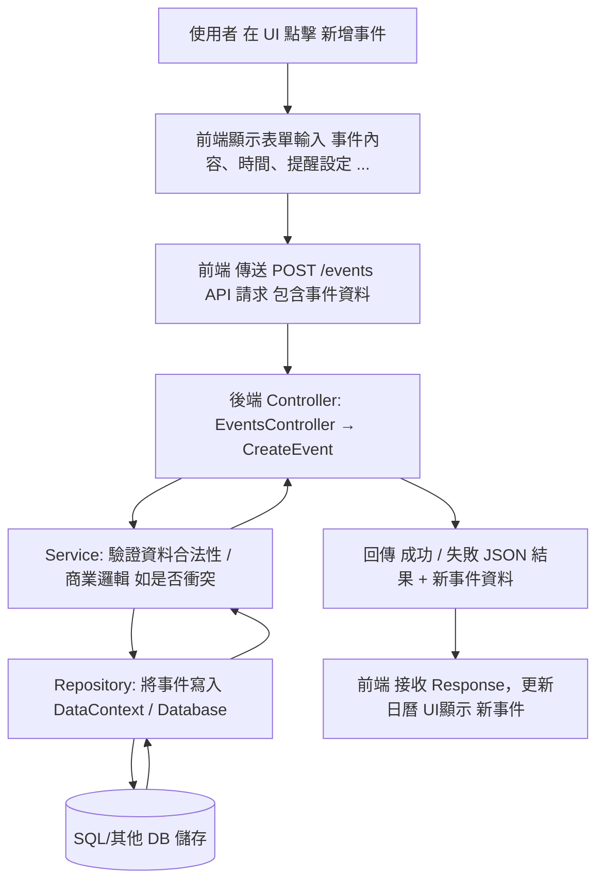

### 主要資料夾／檔案結構如下： 
Controllers/ — Web API 控制器 (endpoint)

Services/ — 服務層 (business logic)

Repositories/ — 資料存取層 (Repository pattern)

Models/ — Domain / 資料模型 (event, user, blog post …)

Data/ — 資料上下文 (DB context) 或種子資料 (seed)，設定資料庫

Program.cs + appsettings.json — 啟動與設定檔

### 三層式架構

將 Controller (API endpoint) / Service (商業邏輯) / Repository (資料存取) 分層，有助於責任分離 — 易於維護、測試、未來擴充。

前端 (Blazor)／後端 (API) 的分離，使 UI 可以專注於互動與顯示，後端專注於資料與邏輯 — modular。

使用者透過前端發送 HTTP request，所有資料操作都透過後端集中管理，安全且易於串接 (也方便日後改用不同前端或 native app)。

### 流程

